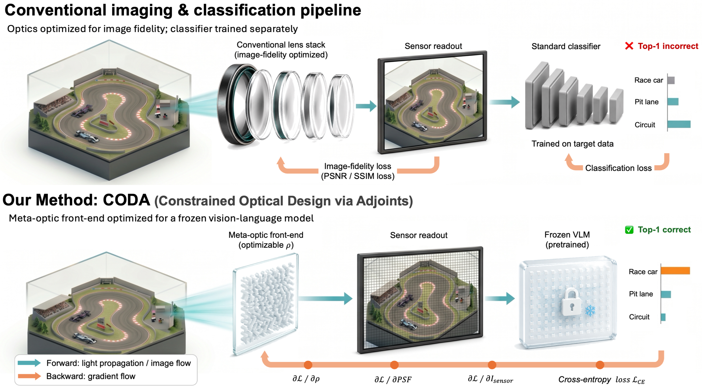

# CODA

**VLM-Aware Meta-Optic Front-End Design for Frozen Vision-Language Models**  
Chanik Kang, Raphaël Pestourie, and Haejun Chung · **ACCV 2026**

[Code repository](https://github.com/latteishorse/VLM-Aware-Meta-Optic-Front-End-Design)



CODA (**Constrained Optical Design via Adjoints**) optimizes a meta-optic for recognition by a frozen vision-language model. Only the optical density is trained: the CLIP encoder and class text embeddings remain fixed. Classification gradients pass through differentiable line-scan image formation and Meep's Maxwell-adjoint solver to update the optic. No learned reconstruction, image signal processing network, or image-fidelity auxiliary loss is used.

This repository provides the core optical-design and evaluation pipeline. The simulated design uses a 5 × 0.6 µm region, 13,400 density variables, three wavelengths (450/550/650 nm), and three incidence angles (−15°/0°/+15°). The study is simulation-only and does not model sensor noise or fabrication tolerances.

## Results

ImageNet-100 validation accuracy with frozen CLIP ViT-L/14, as reported in the final paper (Table 1). Learned designs report mean ± sample standard deviation over three seeds.

| Design | Top-1 accuracy (%) |
|---|---:|
| Clean images | 88.26 |
| Fresnel zone plate | 8.10 |
| Focus-opt | 53.75 ± 3.57 |
| VLM-cold | 47.87 ± 1.76 |
| **VLM-warm** | **65.41 ± 3.99** |

VLM-warm improves on the shared Focus-opt iteration-100 checkpoint (**58.23 ± 2.90%**) by **7.18 percentage points**. The same optics outperform Focus-opt across all nine combinations of CLIP/SigLIP/DINOv2 and ImageNet-100/CIFAR-100/Food-101 without optical re-optimization (Table 3).

ImageNet-100 labels supervise the optics, so its results are **frozen-encoder accuracy**. CLIP/SigLIP evaluation on CIFAR-100 and Food-101 is zero-shot transfer. DINOv2 uses a supervised clean-image linear probe fixed across optical designs.

## Installation

Use Linux, MPI-enabled Meep, and an NVIDIA GPU for the full pipeline. Meep runs across MPI ranks; the vision model runs on rank 0.

```bash
conda create -n coda -c conda-forge python=3.11 'pymeep=*=mpi_mpich_*' mpi4py numpy=1.26.4 pip
conda activate coda

# CUDA 11.8 example; use the appropriate wheel for your system.
python -m pip install torch==2.7.1 torchvision==0.22.1 --index-url https://download.pytorch.org/whl/cu118
python -m pip install -r requirements.txt
python -m pip check
```

See the official [Meep](https://meep.readthedocs.io/en/latest/Installation/) and [PyTorch](https://pytorch.org/get-started/previous-versions/) installation instructions for platform-specific options. Use `mpirun` from the same conda environment.

## Usage

Run from the repository root. Datasets and pretrained weights are downloaded on first use; optimized checkpoints are generated locally.

```bash
# Inspect commands without starting downloads or simulations.
bash scripts/run_pipeline.sh main --dry-run

# Prepare data/Fresnel, optimize three seeds, and evaluate ImageNet-100.
bash scripts/run_pipeline.sh main

# Evaluate the same optics across datasets and encoders.
bash scripts/run_pipeline.sh transfer
```

Individual stages are `setup`, `focus`, `warm`, `cold`, `eval`, and `transfer`. Set `MPI_RANKS=4` to change the default of 16 ranks. Training uses seeds 0, 1, and 2; existing training output directories are preserved and cause the launcher to stop.

| Design | Initialization | Updates | Learning rate |
|---|---|---:|---:|
| Focus-opt | Random density | 200 | 0.05 |
| VLM-cold | Random density | 100 | 0.05 |
| VLM-warm | Same-seed Focus-opt iteration 100 | 100 additional | 0.01 |

VLM optimization uses batches of 16, Adam, gradient norm clipping at 1.0, and projection to [0, 1]. VLM-warm reads `c2_output/seedN/checkpoint_iter0100.npz` directly. The differing learning rates mean the comparisons do not isolate an initialization-only or objective-only effect.

**Implementation status.** Focus-opt implements the normalized concentration objective in Eq. (9), using the central 0.5 µm window and full sensor-line denominator. This corrects the earlier supplied intensity objective. The reported paper results above have not been remeasured with this release; full Focus-opt/VLM-warm benchmark validation remains necessary.

## Files and outputs

| File | Purpose |
|---|---|
| `setup_dataset_embeddings.py` | ImageNet-100 loader, fixed text embeddings, clean-image reference |
| `design_baseline_fresnel.py` | Analytical Fresnel reference |
| `design_focus_opt.py`, `focus_objective.py` | Normalized focal-concentration optimization |
| `design_codesign_vlm.py` | Frozen-CLIP optical optimization: VLM-warm and VLM-cold |
| `eval_zeroshot.py` | ImageNet-100 frozen-encoder evaluation; legacy filename retained |
| `eval_transfer.py` | Cross-dataset/encoder evaluation and DINOv2 probes |
| `scripts/run_pipeline.sh` | Main pipeline and individual stages |

Generated files use `b3_output/` (text/probe caches), `c1_output/` (Fresnel), `c2_output/seedN/` (Focus-opt), `c3_output/100iter_seedN/` (VLM-warm), `c3_output/100iter_seedN_rand/` (VLM-cold), `eval_output/`, and `eval_output_transfer/`. These are excluded by `.gitignore`. Datasets, pretrained weights, optimized checkpoints, supplementary analyses, and figure-generation scripts are not bundled.

Transfer uses `openai/clip-vit-large-patch14`, `google/siglip-large-patch16-256`, and `facebook/dinov2-large`. Default evaluation sizes are 5,000 ImageNet-100 validation images, 10,000 CIFAR-100 test images, and a fixed 5,000-image Food-101 validation subset (seed 42). The DINOv2 implementation selects its probe epoch using clean evaluation-split accuracy and does not seed fresh probe fitting. Existing text/probe caches are reused; rebuild them when changing the model or probe settings.

## Citation

If you use CODA in your research, please cite the accompanying paper:

```bibtex
@inproceedings{kang2026coda,
  title     = {VLM-Aware Meta-Optic Front-End Design for Frozen Vision-Language Models},
  author    = {Kang, Chanik and Pestourie, Rapha{\"e}l and Chung, Haejun},
  booktitle = {Asian Conference on Computer Vision},
  year      = {2026}
}
```

## License

The code is released under the [Apache License 2.0](LICENSE), which permits use, modification, and redistribution, including commercial use, under its terms. See [NOTICE](NOTICE) for attribution. Dependencies, datasets, pretrained models, and the paper retain their respective terms.

Corresponding authors: Raphaël Pestourie (`rpestourie3@gatech.edu`) and Haejun Chung (`haejun@hanyang.ac.kr`).
